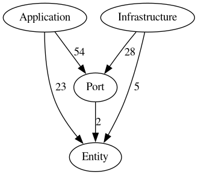
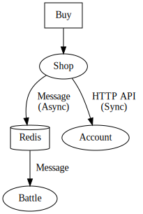

# Notes on my pragmatic (controversial?) choices on code architecture

These are my few notes on what might be a good pragmatic architecture for an application.

## The Seaghi Architecture

Architectures like the hexagonal architecture used with DDD are complex and heavy. Lot of code, mapping hell, bloated domain objects trap, too many technical questionings, books that needs hundreds of pages to explain the basis... Really productive architecture?

The goal here is to take some good parts and compromise in order to have less code, less technical questionings, clear architecture, maintainable code and mostly KISS code. We want to:
- Quickly see infrastructure dependencies (MySQL, Redis, files system, ...)
- Quickly see functional use cases
- Have use case classes with less technical vocabulary and more business language oriented
- Test a use case without the infrastructure dependencies
- Update a framework more easily

General diagram:



Picture generated with:

```sh
# docker build -f ./Dockerfile.deptrac -t deptrac .
docker run --rm -v $(pwd)/seaghi-battle:/repo -u $(id -u ${USER}):$(id -g ${USER})\
 deptrac --formatter=graphviz-image --output=duck_archi_diag.png
```

It looks like bird wings. So I called this architecture the **Seaghi Architecture** (**seag**ull + arc**hi**).

## Overview



Picture generated with:

```sh
dot -T svg -o overview.svg overview.gv
```

## Tree

```
├── Application
│   ├── Component           # Common components for the use cases
|   ├── Enum                # Some enumerations
│   ├── UseCase             # Functional use cases
├── Entity                  # ORM (ODM) Entities
├── Infrastructure          # Technical
│   ├── Client              # External services call
│   ├── EventListener       # Event listeners 
│   ├── HttpApi             # Internal API
│   │   ├── Controller
│   │   └── Dto
│   ├── Messenger           # Message manager
│   └── Persistence         # Persistence (SQL, ...): mainly repo adapter
└── Port                    # Interfaces between Application and Infrastructure
    ├── In                  # From Infrastructure To Application
    │   └── DataContract    # Data holders
    └── Out                 # From Application To Infrastructure
        ├── DataContract    # Data holders
        └── MessageContract # Message data holders
```

## What is Infrastructure?

Infrastructure is here to speak with SQL DB, Redis, RabbitMQ, HTTP API, local folder, ... All those very annoying external resources when we want to test only the use cases.

## What is Application?

The set of the use cases without being concerned with technical resources.

I have at least 2 folders in Application:
- UseCase: objects with only one method.
- Component: business rules used by use cases. If a method of a component uses data from an entity, we should pass the entire entity (and not just the fields we might need) in order to keep this method with a stable signature.

## What is the Domain?

No domain here (no domain objects, no value objects). I think it is the most controversial choice here.

I want to reduce code and especially the mapping. I want to avoid the trap of bloated domain objects that have sometimes too much responsibility.

I use anemic Entity. An entity may be linked to an ORM, ODM, ... I choose to separate data and behavior. Business rules are split into services and apply to entities through their methods. This practice goes against the principles of DDD.

We can define validations in the entity (via annotation, via setter). We can create special methods to keep some groups of properties valid. An entity can have an invalid state during its journey in a layer, and we can validate this entity just before crossing a layer.

Where to put these entities ? Since there is a dependency with the infrastructure, I put these objects in a separate namespace to represent these dependencies (folder "Entity").

- https://www.martinfowler.com/bliki/AnemicDomainModel.html
- https://tmichel.github.io/2015/09/14/oo-controversies-tell-dont-ask-vs-the-web/
- http://blog.inf.ed.ac.uk/sapm/2014/02/04/the-anaemic-domain-model-is-no-anti-pattern-its-a-solid-design/
- https://enterprisecraftsmanship.com/posts/having-the-domain-model-separate-from-the-persistence-model/
- https://khorikov.org/posts/2020-04-20-when-do-you-need-persistence-model/

## What is Port

The border between the Application and the Infrastructure: only interfaces and data contracts.

## What is a (bounded) context?

From "Patterns, Principles, and Practices of Domain-Driven Design" (Scott Millet):

> A bounded context is a linguistic boundary. It isolates models to remove ambiguity within UL.

UL: Ubiquitous Language (common language). 

Two context here: Shop and Battle.

We can communicate between contexts in many ways:
- By directly calling the objects (only via interfaces)
- With HTTP calls (`symfony/http-client`)
- With messages (`symfony/messenger`)
- ...

## Data holder objects are immutable.

Data holder objects (DTO, Message, ...) are immutable to avoid side effect and to ease the debug. It is a final and valid unit of data. We know the layer that created this data object, and we know that this object is not updated during its journey to the next layer.

DTO should be used only for one use case. Avoid several use cases using the same DTO.

When used with controller, use one DTO for only one view. Do not one DTO for several views. Same for message handlers.

Some DTOs are shared between Application and Infrastructure. I consider an immutable data holder as a "data contract": we have access to these data, this data holder was created with valid data and this data has not been modified since the creation of this data holder (When we sign a contract, the contract is meant to be valid and should not be changed). So I put these DTOs in Port. Folder "DataContract" for general DTO and folder "MessageContract" for the message data holders.

## Entities are mutable

An Entity has an identity and change during its lifetime. For example a customer address may change, but it is still the same customer. The id, if not null, never change. In the case of an ORM, do not define a setter for the id; it is managed by the ORM.

## Controller

Use one route for one view. Few code (logs + a method for validation + a method for processing). Do not use one route for several views. Decouple the controller and view: here I use `HttpApiSerializeSubscriber` but there are several ways to solve this problem.

- https://en.wikipedia.org/wiki/Action–domain–responder

## Commands and message handlers

Minimal code here (logs + a method for validation + a method for processing).

## One public method in a use case

Prefer one public method in a use case. It's easier to see use cases at a glance just by looking at the class names.

## A service does not contain a state

A service must be stateless.

## Short circuit ?

For example a Controller in Infrastructure only need raw data from an API. Do we need to call Application for that (there isn't really a use case) or do we call the API directly from the controller? The two solutions may be acceptable. If we don't call the Application then the use case does not appear in Application and there is a direct dependency between the controller view and the API. If we call the application then there is more code and more mapping but the use case appears.

## Autowiring (Symfony)

We can exclude Port and Entity folders from available services.

In `services.yaml` do not match interfaces in `Port` for test env (use mocks in unit tests). Match interfaces for dev and prod env. For example:

```yaml
App\Battle\Port\In\HitMonsterPort: '@App\Battle\Application\UseCase\HitMonster'
```

## The exceptions

Important rule: throw early catch late. It doesn't matter if the exception crosses multiple layers.

We may use standard PHP exception in Application.

## Avoid inheritance

Avoid inheritance. Use composition.

## Do not use one bloated repository (adapter) for each entity

Split the repositories (adapters).

## Comment

Avoid using the annotations `@return`, `@param`, `@var`. It is often useless. We can use it for array: `MyObject[]`.

Prefer this style:

```php
/**
 * Roll a $dice.
 *
 * The result of this action is a number of one of the faces.
 * You may add a $modifier to add to the result.
 */
public function roll(Dice $dice, int $modifier = 0): int
{

}
```

Dart uses this style: https://dart.dev/guides/language/effective-dart/documentation#do-use-prose-to-explain-parameters-return-values-and-exceptions

## Null safety

Prefer a null safety approach.

## Continuous improvement

Continuous improvement is very important. Don't be afraid to continually refactor/update/improve the code. It is vital. If we don't do this the application will degrade beyond repair.

## Duplicate code

Do not fear to duplicate code between context. Do not create common code between context. For example here we have the context Shop and the context Battle.

## Validations

- Infrastructure: technical validations (not null, positive number, ...)
- Application: business validations (person age check, valid address, ...)

For example:
- In infrastructure: level must be a positive number (`App\Battle\Infrastructure\Messenger\MonsterSoldMessageHandler::__invoke`)
- In Application: there is a business rule that said monsters below level 2 are not accepted for battle (`App\Battle\Application\UseCase\SpawnMonster::spawn`).

## Fluent interface for getter and setter?

I don't like fluent interface for getter and setter. Nevertheless, it's widely used.

- https://ocramius.github.io/blog/fluent-interfaces-are-evil/

## Use a tool to check the dependencies

For example: https://github.com/qossmic/deptrac

## Tests

Different types of tests are possible:

- classic unit tests for each method
- test on a use case (mock Port)
- test only Infrastructure (mock Port, test persistence with a real db, test controllers with a http client, ...)
- test all the application without mock

Few tips:
- When a test interacts with a DB, it should rollback the changes.
- Add a test when we encounter a bug.

## Books

- Patterns, Principles, and Practices of Domain-Driven Design (Scott Millett)
- Get Your Hands Dirty on Clean Architecture (Tom Hombergs)
