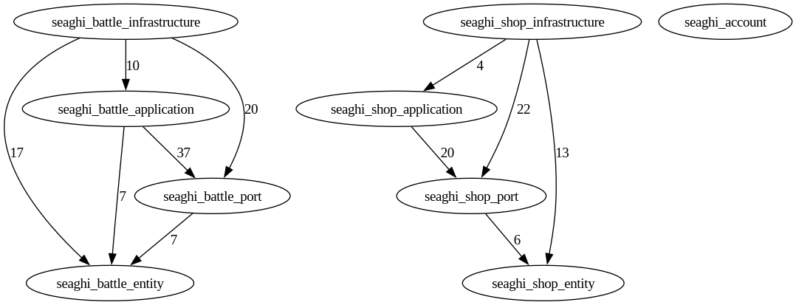
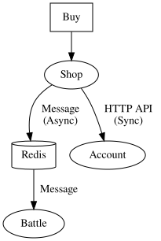

# Some thoughts on code architecture

These are my few notes on what might be a good pragmatic architecture for an application.

## The Seaghi Architecture

Architectures like the hexagonal architecture used with DDD are complex and heavy. Lot of code, mapping hell, bloated domain objects trap, too many technical questionings, books that need hundreds of pages to explain the basis... Really productive architecture?

The goal here is to take some good parts and compromise to have less code, less technical questionings, clear architecture, maintainable code, and mostly KISS code. We want to:
- Quickly see infrastructure dependencies (MySQL, Redis, files system, ...)
- Quickly see functional use cases
- Have use case classes with less technical vocabulary and more business language oriented
- Test a use case without the infrastructure dependencies
- Update a framework more easily

General diagram:



Picture generated with:

```sh
make deptrac-diag
```

It looks like bird wings. So I called this architecture the **Seaghi Architecture** (**seag**ull + arc**hi**).

## Overview



Picture generated with:

```sh
dot -T svg -o overview.svg overview.gv
```

## Tree

```
├── Application
│   ├── Component           # Cross-cutting policies and domain services
|   ├── Enum                # Domain enumerations
│   └── UseCase             # Functional use cases (concrete, directly called by controllers)
├── Entity                  # Rich Domain / ORM Entities (Invariants & State transitions)
├── Infrastructure          # Technical delivery & adapters
│   ├── Client              # External services call
│   ├── EventListener       # Event listeners 
│   ├── HttpApi             # Internal API
│   │   ├── Controller
│   │   └── Dto
│   ├── Messenger           # Message manager
│   └── Persistence         # Persistence (SQL, ...): repo adapters
└── Port                    # Outbound interfaces & Cross-layer contracts
    ├── DataContract        # Cross-layer DTOs (Use Case inputs & outputs)
    ├── MessageContract     # Asynchronous message data holders
    └── Out                 # Outbound interfaces (Repositories, Clients, Messenger, Transactions)
```

## What is Infrastructure?

Infrastructure is here to speak with SQL DB, Redis, RabbitMQ, HTTP API, local folder, ... All those very annoying external resources when we want to test only the use cases.

## What is Application?

The set of the use cases without being concerned with technical resources.

I have at least two folders in Application:
- UseCase: objects with only one public method representing a business use case.
- Component: cross-cutting business rules, policies, or domain services used by use cases when a rule spans multiple entities or requires external collaborators. When passing data to a Component or helper, pass only the required primitives or Value Objects (following the Interface Segregation Principle), not the full ORM entity graph. This keeps components reusable and trivial to unit-test.

## What is the Domain? (Pragmatic Domain: Combining Domain & Entity)

Rather than maintaining two parallel object hierarchies (a pure Domain object and an ORM Entity) and suffering from "mapping hell", we pragmatically combine the Domain model with the persistence model in **Rich Entities**.

Doctrine ORM is configured directly on these entities, but they are **not anemic**:
- **No naive public setters:** We avoid generic setters like `setAvailable(bool)` or `setLevel(int)` that leave the entity open to arbitrary, illegal state mutations.
- **Intention-revealing business methods:** State transitions are guarded by semantic methods (e.g. `markAsSold()`, `levelUp()`, `isReadyToFight()`).
- **Make illegal states unrepresentable:** An entity must always represent a valid state. We do not allow an entity to be in an invalid state during its lifecycle.
- **Tell, Don't Ask:** Instead of extracting entity fields to check logic externally in a service, we tell the entity what action to perform.

### Preventing Infrastructure Leaks in Rich Entities:
Even though entities use Doctrine mapping attributes directly, we must prevent infrastructure mechanics from polluting application logic:
- **Avoid Lazy-Loading in Application logic:** When a Use Case requires related entities, the repository must eager-load them (e.g. DQL `JOIN FETCH`). Accessing an uninitialized relation in Application should never silently trigger hidden SQL queries or throw detached proxy exceptions.
- **Keep Collection signatures native:** Internally, entities can use `Doctrine\Common\Collections\Collection`, but public getters must return a native PHP `array` (`$this->skills->toArray()`) or native `iterable`. This prevents Doctrine interfaces from leaking into Application signatures.
- **Defensive copying:** Returning `$collection->toArray()` ensures callers cannot mutate the entity's internal collection from the outside.
- **Favor domain actions over exposing collections:** Prefer methods like `$monster->learnSkill($skill)` or `$monster->hasSkill($code)` rather than exposing raw collections.

### Preventing Entity Bloat:
To prevent entities from growing into "God objects":
1. **Scope to Bounded Contexts:** An entity model in `Shop` is distinct from an entity in `Battle`, even if they share or link to the same database tables.
2. **CQRS for Reads:** Entities are strictly write models (for state changes and invariants). Display, query, and search operations bypass the entity and return read DTOs directly.
3. **Value Objects:** Group related cohesive properties and behavior into immutable Value Objects (e.g. `Price`, `Health`).
4. **Policy / Rule Services:** Complex multi-entity calculations or business policies that evolve frequently go into dedicated rule/policy services in Application, while intrinsic state invariants remain inside the entity.

- https://www.martinfowler.com/bliki/AnemicDomainModel.html
- https://martinfowler.com/bliki/TellDontAsk.html
- https://enterprisecraftsmanship.com/posts/having-the-domain-model-separate-from-the-persistence-model/
- https://khorikov.org/posts/2020-04-20-when-do-you-need-persistence-model/

## What is Port

Port represents the boundary between Application and Infrastructure:

### 1. Inbound: No 1-to-1 `Port\In` Interfaces (Pragmatic Inward Dependencies)
We intentionally **do not create 1-to-1 interfaces for Use Cases** (no `BuyItemPort` for `BuyItem`).
- **Clean Architecture Dependency Rule:** Outer delivery mechanisms (Controllers, CLI commands, Message Handlers) naturally depend **inward** on the Application core (`Controller -> UseCase`).
- **KISS & Zero Boilerplate:** Business Use Cases almost never have multiple implementations in production. Dropping `Port\In` interfaces eliminates redundant single-method interfaces, saves 30% file overhead, and allows Symfony to autowire Use Cases directly with zero manual configuration in `services.yaml`.
- **Testing:** Controllers can easily stub or mock concrete Use Cases in PHPUnit without requiring an interface.

### 2. Outbound (`Port/Out`): Strict Dependency Inversion
The Application layer must never depend on external technical infrastructure (Doctrine ORM, Redis, RabbitMQ, HTTP APIs).
- Outbound interfaces (`MonsterRepositoryPort`, `TransactionPort`, `WithdrawFromAccountPort`, `SendMessagePort`) live in `Port/Out`.
- Infrastructure implements these interfaces in `Infrastructure/Persistence`, `Infrastructure/Client`, etc.

### 3. Contracts (`DataContract` & `MessageContract`)
- `DataContract`: Immutable DTOs exchanged between outer layers and Use Cases (request inputs and response outputs).
- `MessageContract`: Immutable message objects dispatched for asynchronous processing.

## What is a (bounded) context?

From "Patterns, Principles, and Practices of Domain-Driven Design" (Scott Millet):

> A bounded context is a linguistic boundary. It isolates models to remove ambiguity within UL.

UL: Ubiquitous Language (common language). 

Two contexts here: Shop and Battle.

We can communicate between contexts in many ways:
- By directly calling the objects (only via interfaces)
- With HTTP calls (`symfony/http-client`)
- With messages (`symfony/messenger`)
- ...

## Data holder objects are immutable.

Data holder objects (DTO, Message, ...) are immutable to avoid side effects and to ease the debug. It is a final and valid unit of data. We know the layer that created this data object, and we know that this object is not updated during its journey to the next layer.

DTO should be used only for one use case. Avoid several use cases using the same DTO.

When used with a controller, use one DTO for only one view. Do not use one DTO for several views. Same for message handlers.

TODO: MessageContract?

Some DTOs are shared between Application and Infrastructure. I consider an immutable data holder as a "data contract": we have access to these data, this data holder was created with valid data, and this data has not been modified since the creation of this data holder (When we sign a contract, the contract is meant to be valid and should not be changed). So I put these DTOs in Port. Folder "DataContract" for general DTO and folder "MessageContract" for the message data holders.

## Value Object

- Throwing an exception (or using a type like `Result<ValueObject, ValidationError>`) during validation while creating a value object is considered a standard good practice: value objects must represent valid domain concepts at all times.
- Prefer using static factory methods with private constructors: clearer intent, multiple constructors, and a single entry point.

## Entities are mutable

An Entity has an identity and changes during its lifetime. For example, a customer address may change, but it is still the same customer.

- The ID, once assigned, never changes. Never define a setter for the ID; it is managed by the ORM or generated at instantiation.
- Prefer UUIDv7 over autoincrement.
- Avoid exposing public setters for mutable state. Use semantic methods (`changeAddress()`, `markAsSold()`) that enforce invariants before updating internal properties.
- Entities should remain shielded from external layers: Controllers and API adapters receive DTOs (DataContracts), never entities directly.

## Controller

Use one route for one view. Few code (logs + a method for validation + a method for processing). Do not use one route for several views. Decouple the controller and view: here I use `HttpApiSerializeSubscriber` but there are several ways to solve this problem.

- https://en.wikipedia.org/wiki/Action–domain–responder

## Commands and message handlers

Minimal code here (logs + a method for validation + a method for processing).

## One public method in a use case

Prefer one public method in a use case. It's easier to see use cases at a glance just by looking at the class names.

## A service does not contain a state

A service must be stateless.

## Library (dependency)

### What Can Go in the Domain Core?

You can freely use external libraries in your domain/application layers if they satisfy three conditions:

- **Pure in-memory operations:** They do not perform network requests, file access, or database I/O.
- **Stable & lightweight:** They have no transitively heavy framework dependencies.
- **Represent generic concepts or specifications:** Money, math, string manipulation, dates, or validation assertions.

### What MUST Stay in the Infrastructure Layer?

Any dependency that touches external state, framework containers, or I/O drivers belongs exclusively in adapters and infrastructure:

- **Framework Core**
- **Persistence / ORM**
- **Network & Serialization**
- **Third-Party APIs:**

## Short circuit?

For example, a Controller in Infrastructure only needs raw data from an API. Do we need to call Application for that (there isn't really a use case), or do we call the API directly from the controller? The two solutions may be acceptable. If we don't call the Application, then the use case does not appear in Application, and there is a direct dependency between the controller view and the API. If we call the application, then there is more code and more mapping, but the use case appears.

## Autowiring (Symfony)

We can exclude `Port` and `Entity` folders from service discovery.

Because Use Cases are concrete classes, Symfony autowires them automatically into Controllers with **zero configuration** in `services.yaml`.

For outbound interfaces in `Port/Out` (`MonsterRepositoryPort`, `TransactionPort`), Symfony autowires them automatically to their respective Infrastructure implementation classes. Manual aliases in `services.yaml` are only required if an interface has multiple implementations in the same environment.

## The exceptions

Important rule: throw early, catch late. It doesn't matter if the exception crosses multiple layers.

We may use a standard PHP exception in Application.

## Avoid inheritance

Avoid inheritance. Use composition.

## Repositories & Persistence (Ports & Transactions)

### 1. Typed Repository Ports over Generic CRUD
Do not use a generic `FindEntityPort` or `PersistEntityPort` that handles `object`. Generic ports destroy compile-time type safety, disable PHPStan static analysis, and force brittle `/** @var */` and `assert()` annotations everywhere.

- **Split repositories per Aggregate Root:** Create dedicated, typed outbound ports (e.g. `MonsterRepositoryPort`) in `Port/Out`.
- **Differentiate `get()` and `find()`:**
  - `get(Uuid $id): Monster` throws a `MonsterNotFoundException` immediately if not found (eliminating repetitive null checks in Use Cases).
  - `find(Uuid $id): ?Monster` returns nullable when absence is a normal, expected business outcome.
- **Save explicitly:** `save(Monster $monster): void` declares the entity for persistence.

### 2. Atomic Transactions via `TransactionPort::run(callable)`
Avoid leaking technical ORM jargon like `flush()` or `unitOfWork` into Use Cases. Instead, use an explicit, business-oriented transaction runner:

```php
namespace App\Shop\Port\Out;

interface TransactionPort
{
    /**
     * @template T
     * @param callable(): T $operation
     * @return T
     */
    public function run(callable $operation): mixed;
}
```

- **Implementation in Infrastructure:** Implemented via Doctrine's `$entityManager->wrapInTransaction($callable)`.
- **Performance:** Avoids multiple flushes across services. A single transaction computes change-sets once, minimizes database round-trips, and shortens row lock durations.
- **Predictable & Universal:** Works identically across Web Controllers, Messenger workers, CLI commands, and PHPUnit integration tests without fragmented, magic event listeners.
- **Automatic Rollback:** If an exception is thrown inside the callable, the transaction rolls back automatically.

### 3. Safe Event & Message Dispatching
Never dispatch asynchronous messages (e.g. RabbitMQ, Redis) inside or before the database transaction:
- Dispatch messages strictly **after** `$this->transaction->run()` commits successfully.
- If the transaction fails or rolls back, execution halts and the message is never sent.
- **Test in PHPUnit:** Always write a unit test with `$sendMessageMock->expects($this->never())->method('send')` to verify that when a transaction fails, no message is dispatched.

## Comment

Avoid using the annotations `@return`, `@param`, `@var`. It is often useless. We can use it for an array: `MyObject[]`.

Prefer this style:

```php
/**
 * Roll a $dice.
 *
 * The result of this action is a number of ones of the faces.
 * You may add a $modifier to add to the result.
 */
public function roll(Dice $dice, int $modifier = 0): int
{

}
```

Dart uses this style: https://dart.dev/guides/language/effective-dart/documentation#do-use-prose-to-explain-parameters-return-values-and-exceptions

## Null safety

Prefer a null safety approach.

## Continuous improvement

Continuous improvement is crucial. Don't be afraid to continually refactor/update/improve the code. It is vital. If we don't do this, the application will degrade beyond repair.

## Duplicate code

Do not fear duplicating code between context. Do not create common code between context. For example, here we have the context Shop and the context Battle.

## Validations

Validations are divided into three distinct levels:

1. **Infrastructure (Input & Format Validation):** Technical input validation on DTOs/Requests via attributes or constraints (e.g. valid JSON format, non-empty string, valid UUID format).
2. **Entity & Value Objects (Domain Invariants):** Invariants that must be true at all times (e.g. a level cannot be negative, a sick monster cannot fight, price must be greater than zero). Protected by private constructors, Value Objects, and entity business methods.
3. **Application (Contextual Business Rules & Policies):** Complex business rules involving external collaborators or multi-entity coordination (e.g. checking customer balance against an account API, verifying battle season rules).

## Use a tool to check the dependencies

For example: https://github.com/qossmic/deptrac

## Tests

Different types of tests are possible:

- classic unit tests for each method
- test on a use case (mock Port)
- test only Infrastructure (mock Port, test persistence with a real db, test controllers with an http client, ...)
- test all the application without mock

Few tips:
- When a test interacts with a DB, it should rollback the changes.
- Add a test when we encounter a bug.

## Books

- Patterns, Principles, and Practices of Domain-Driven Design (Scott Millett)
- Get Your Hands Dirty on Clean Architecture (Tom Hombergs)
